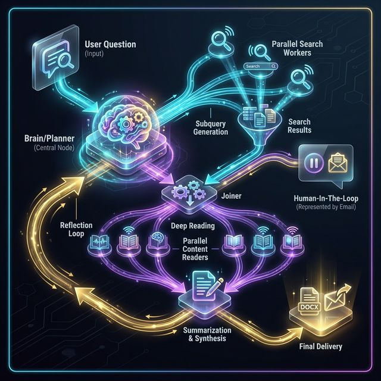

# Deep Research Agent 🚀

An autonomous AI research assistant built with **LangGraph** that performs recursive web research, synthesizes professional reports, and delivers them via email as `.docx` attachments.

## 🧠 How It Works: Architecture Deep Dive

The Deep Research Agent is choreographed using a stateful directed acyclic graph (DAG) via **LangGraph**. Unlike standard chatbots, it follows a rigorous multi-stage pipeline:

### 1. Planning & Subquery Generation
The agent starts by analyzing the user's question through a **Planner** node. It creates a high-level research plan and breaks it down into multiple, targeted sub-queries. This "fragmentation" ensures that different facets of the topic are researched in parallel.

### 2. Parallel Search & Join
The agent utilizes a **Fan-Out** pattern to dispatch multiple **Search Workers** simultaneously. Each worker queries the **Tavily AI** API. Once all searches complete, a **Joiner** node aggregates the raw search results, deduplicates hits, and prepares them for deep reading.

### 3. Deep Reading & Summarization
For the top results, the agent fans out again into **Content Reader** nodes. These nodes use **Trafilatura** to scrape clean text from web pages and then summarize each source relative to the original question. This ensures only the most relevant "gold" nuggets of information make it into the final report.

### 4. Synthesis & Reflection
The **Synthesizer** compiles all summaries, search results, and citations into a comprehensive Markdown report. Before finishing, a **Reflector** node evaluates the draft. If it identifies gaps or area for improvement, it circles back to the Planning stage for another round of research.

### 5. Human-In-The-Loop (HITL) & Delivery
Once the report is ready, the agent hits an `interrupt()` point. It pauses execution and prompts the user in LangGraph Studio to provide the **Receiver's Email Address**. 
Upon resuming:
- The **Word Generator** converts the Markdown into a structured `.docx` file.
- The **SMTP Engine** sends a beautifully formatted HTML email with the document attached.

## Features
- **Recursive Reasoning**: Iteratively improves its research through reflection.
- **DOCX Export**: Automated conversion from Markdown to Microsoft Word.
- **HITL Verification**: Interactive input for dynamic delivery.
- **Async Execution**: Faster processing through parallel search and read workers.

## Prerequisites
- Python 3.9+
- [LangGraph CLI](https://github.com/langchain-ai/langgraph)
- API Keys: [Groq](https://wow.groq.com/), [Tavily](https://tavily.com/)
- [Gmail App Password](https://support.google.com/accounts/answer/185833) (for SMTP)

## Setup & Deployment
Refer to the [Implementation Walkthrough](walkthrough.md) for detailed setup and LangGraph Cloud deployment steps.
